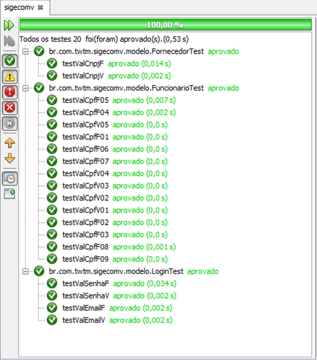

# Estratégias para Testes de Unidade – SIGECOMV
Este repositório contém exemplos de estratégias para testes de unidade do projeto SIGECOMV.  
Os códigos apresentados são demonstrativos da aplicação do JUnit no projeto.

## Ambiente
Java  
JUnit  
NetBeans  

## Resultados
Saída das asserções realizadas pelo JUnit  

