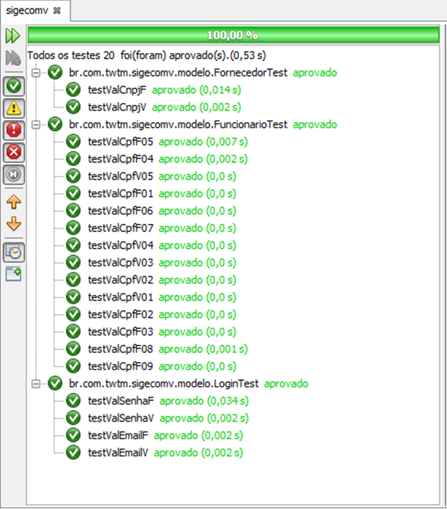

# SIGECOMV – Estratégias para Testes de Unidade
Uma unidade é a menor parte testável da aplicação. Em Java, um método é uma unidade.  
Normalmente, a asserção de um método parte de argumentos que produzem um retorno esperado e correto.  
Este repositório contém exemplos de estratégias para testes de unidade do projeto SIGECOMV.  
Os códigos apresentados são demonstrativos da aplicação do JUnit no projeto.

## Ambiente
Os elementos abaixo compõem o ambiente de testes utilizado.
- Java 1.8.0_31  
- JUnit 4.12  
- NetBeans 8.1  
- Windows 7

## Resultados

Uma asserção por teste torna a verificação mais precisa e detalhada. Por outro lado, várias asserções por teste deixam o código mais enxuto, mas podem causar confusão na ocorrência de algum erro. Verifique na figura abaixo a saída das asserções executadas pelo JUnit.  

